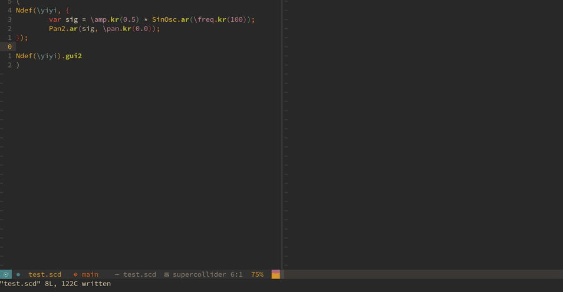

# NodeProxyGui2



An alternative to SuperCollider's built-in (and partly broken) Ndef.gui method.

Usage is very simple. Instead of calling `gui` on a nodeproxy object you simply call `gui2`:
```supercollider
Ndef(\yiyi, {|freq=100, amp=0.5, pan=0| 
	Pan2.ar(SinOsc.ar(freq), pos: pan, level: amp)
});

Ndef(\yiyi).gui2;
```

## Design goals

The reason for this package's existence is to experiment with fixing some issues that are currently in the built in NodeProxy GUI for SuperCollider. These aren't all fixed, but include:

* User scaleable layout – have GUI elements resize with window size.
* Readable text and values – the font size should be readable on modern screens, and labels should not overflow
* Add small extra features like allowing parameters to be randomized
* Use sensible defaults for parameter Specs – if no Spec is defined with the NodeProxy, it should fall back to `[0.0, 1.0, \lin].asSpec` and not some random guess. Also, use a search hierarchy: Look in the NodeProxies specs, then in the global `ControlSpec.specs` and if both those fails, fall back to a default.
* A neutral look and feel. It shouldn't try to be clever with colors, unless necessary.

## Installation

Open up SuperCollider and evaluate the following line of code:
`Quarks.install("https://github.com/madskjeldgaard/nodeproxygui2")`
